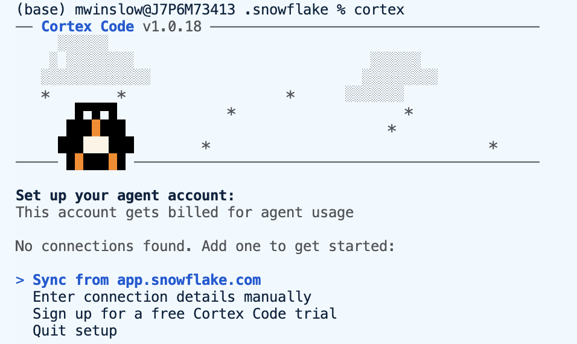
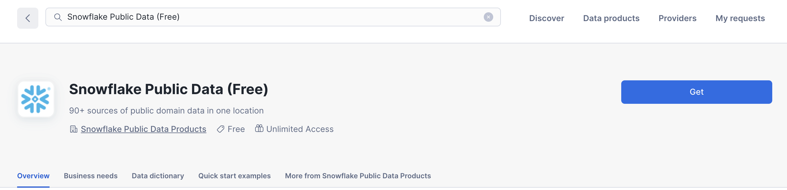
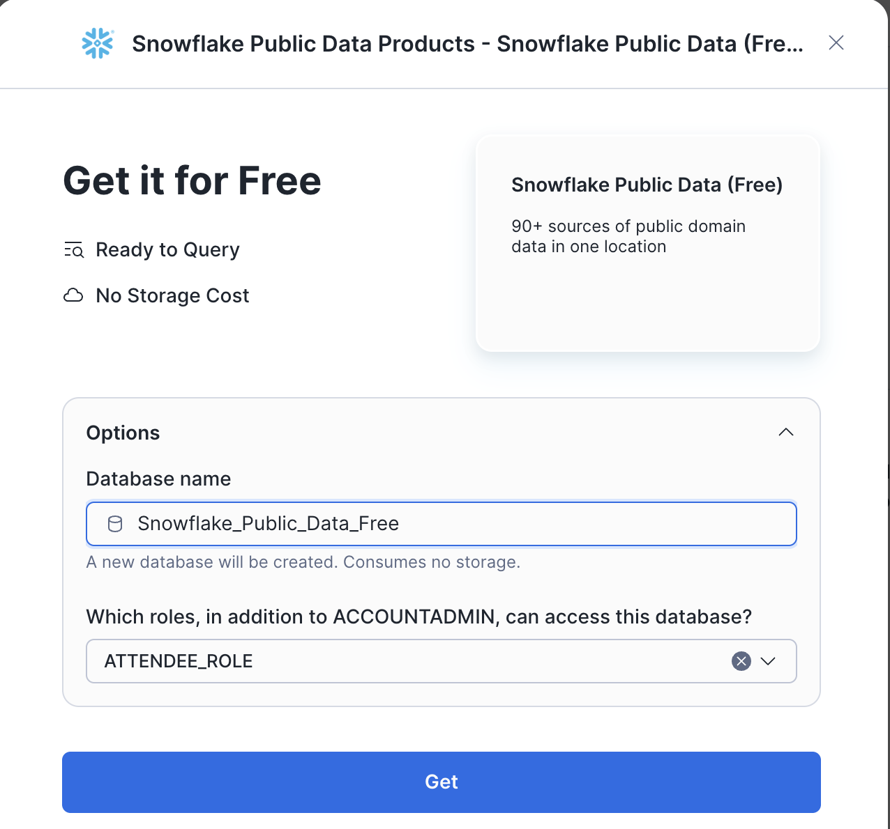

# Cortex Code Demo: Semantic View & Cortex Agent Optimization

This demo showcases Cortex Code's capabilities for building and optimizing Semantic Views and Cortex Agents using the `semantic-view-optimization` and `agent-optimization` skills.

## Demo Overview

* **Source Data:**   
* SNOWFLAKE\_PUBLIC\_DATA\_FREE.PUBLIC\_DATA\_FREE (Stock Price Timeseries, Company Index)   
* **Target Database:** DB\_STOCK.CURATED   
* **Final Deliverables:**  
- Dynamic Tables: DAILY\_STOCK\_PRICES, COMPANIES  
- Semantic View: STOCK\_ANALYSIS  
- Cortex Agent: STOCK\_ANALYST

## Prerequisites

Download Cortex Code

```shell
curl -LsS https://ai.snowflake.com/static/cc-scripts/install.sh | sh
```

Podman not required for demo. Don't install
```shell
Podman is required for sandbox functionality. Would you like to install it? [Y/n] n
```

```shell
# Start Cortex Code
cortex
```

Use browser to setup connections file. 


If you hit an error, you will need to go back to Snowsight (Snowflake Browser) and run the following command as ADMIN

```
ALTER ACCOUNT SET CORTEX_ENABLED_CROSS_REGION = 'ANY_REGION';
```

Once in Cortex Code, verify your connection:

```
show me my current role and database
```

Back in Snowsight, go to the Marketplace and search for Snowflake Public Data (Free). 



Press Get, enter email, then enter the following info.



---

## Use Case 1: Create Semantic View from Scratch

### **Prompt 1.1: Set up infrastructure**

**Skill:** Direct prompt (no skill needed for infrastructure setup)

```
Create a new database called DB_STOCK with a schema called CURATED. Then create two dynamic tables:

1. DAILY_STOCK_PRICES - pivot the data from SNOWFLAKE_PUBLIC_DATA_FREE.PUBLIC_DATA_FREE.STOCK_PRICE_TIMESERIES to have columns: TICKER, DATE, ASSET_CLASS, PRIMARY_EXCHANGE_NAME, OPEN_PRICE, CLOSE_PRICE, HIGH_PRICE, LOW_PRICE, VOLUME. Use TARGET_LAG of 1 day.

2. COMPANIES - from SNOWFLAKE_PUBLIC_DATA_FREE.PUBLIC_DATA_FREE.COMPANY_INDEX with columns: COMPANY_ID, COMPANY_NAME, TICKER (from PRIMARY_TICKER), PRIMARY_EXCHANGE_NAME, CIK, LEI. Only include rows where PRIMARY_TICKER is not null.
```

### Expected SQL Output:

```sql
-- Database and Schema
CREATE DATABASE IF NOT EXISTS DB_STOCK;
CREATE SCHEMA IF NOT EXISTS DB_STOCK.CURATED;

-- Dynamic Table: DAILY_STOCK_PRICES
CREATE OR REPLACE DYNAMIC TABLE DB_STOCK.CURATED.DAILY_STOCK_PRICES
  TARGET_LAG = '1 day'
  WAREHOUSE = COMPUTE_WH
AS
SELECT 
    TICKER, DATE, ASSET_CLASS, PRIMARY_EXCHANGE_NAME,
    MAX(CASE WHEN VARIABLE = 'pre-market_open' THEN VALUE END) AS OPEN_PRICE,
    MAX(CASE WHEN VARIABLE = 'post-market_close' THEN VALUE END) AS CLOSE_PRICE,
    MAX(CASE WHEN VARIABLE = 'all-day_high' THEN VALUE END) AS HIGH_PRICE,
    MAX(CASE WHEN VARIABLE = 'all-day_low' THEN VALUE END) AS LOW_PRICE,
    MAX(CASE WHEN VARIABLE = 'nasdaq_volume' THEN VALUE END) AS VOLUME
FROM SNOWFLAKE_PUBLIC_DATA_FREE.PUBLIC_DATA_FREE.STOCK_PRICE_TIMESERIES
GROUP BY TICKER, DATE, ASSET_CLASS, PRIMARY_EXCHANGE_NAME;

-- Dynamic Table: COMPANIES
CREATE OR REPLACE DYNAMIC TABLE DB_STOCK.CURATED.COMPANIES
  TARGET_LAG = '1 day'
  WAREHOUSE = COMPUTE_WH
AS
SELECT COMPANY_ID, COMPANY_NAME, PRIMARY_TICKER AS TICKER, PRIMARY_EXCHANGE_NAME, CIK, LEI
FROM SNOWFLAKE_PUBLIC_DATA_FREE.PUBLIC_DATA_FREE.COMPANY_INDEX
WHERE PRIMARY_TICKER IS NOT NULL;
```

### **Prompt 1.2: Create semantic view**

**Skill:** Use `semantic-view-optimization` skill to create the semantic view

```
Use the semantic-view-optimization skill to create a semantic view called STOCK_ANALYSIS in DB_STOCK.CURATED that:
- Includes both DAILY_STOCK_PRICES and COMPANIES tables
- Defines a relationship between them on TICKER
- Exposes price columns as facts and TICKER/DATE as dimensions
- Add synonyms for natural language understanding
- Include calculated facts for daily change and daily change percentage
- Add metrics for common aggregations (avg price, total volume, etc.)
- Include AI_SQL_GENERATION and AI_QUESTION_CATEGORIZATION instructions
```

**Note:** The semantic-view-optimization skill will guide you through creating an optimized semantic view. It will analyze the source tables and recommend best practices.

### Expected Optimized SQL:

```sql
CREATE OR REPLACE SEMANTIC VIEW DB_STOCK.CURATED.STOCK_ANALYSIS
TABLES (
    stock_prices AS DB_STOCK.CURATED.DAILY_STOCK_PRICES
        PRIMARY KEY (TICKER, DATE)
        WITH SYNONYMS = ('prices', 'stock data', 'trading data', 'market data')
        COMMENT = 'Daily stock price data with OHLCV values. Common values: AAPL (Apple), MSFT (Microsoft), GOOGL (Google), TSLA (Tesla), NVDA (NVIDIA)',
    companies AS DB_STOCK.CURATED.COMPANIES
        PRIMARY KEY (TICKER)
        WITH SYNONYMS = ('firms', 'corporations', 'issuers')
        COMMENT = 'Company information linked to stock tickers'
)
RELATIONSHIPS (
    stock_to_company AS stock_prices (TICKER) REFERENCES companies
)
FACTS (
    stock_prices.open_price AS OPEN_PRICE WITH SYNONYMS = ('opening price', 'open'),
    stock_prices.close_price AS CLOSE_PRICE WITH SYNONYMS = ('closing price', 'close', 'end price'),
    stock_prices.high_price AS HIGH_PRICE WITH SYNONYMS = ('daily high', 'high', 'max price'),
    stock_prices.low_price AS LOW_PRICE WITH SYNONYMS = ('daily low', 'low', 'min price'),
    stock_prices.volume AS VOLUME WITH SYNONYMS = ('trading volume', 'shares traded'),
    stock_prices.daily_change AS (CLOSE_PRICE - OPEN_PRICE),
    stock_prices.daily_change_pct AS ((CLOSE_PRICE - OPEN_PRICE) / NULLIF(OPEN_PRICE, 0) * 100)
)
DIMENSIONS (
    stock_prices.ticker AS TICKER WITH SYNONYMS = ('symbol', 'stock symbol'),
    stock_prices.trading_date AS DATE WITH SYNONYMS = ('date', 'trade date'),
    stock_prices.trading_year AS YEAR(DATE),
    stock_prices.trading_month AS MONTH(DATE),
    stock_prices.asset_class AS ASSET_CLASS,
    stock_prices.exchange AS PRIMARY_EXCHANGE_NAME,
    companies.company_name AS COMPANY_NAME
)
METRICS (
    stock_prices.avg_close_price AS AVG(stock_prices.close_price),
    stock_prices.avg_volume AS AVG(stock_prices.volume),
    stock_prices.total_volume AS SUM(stock_prices.volume),
    stock_prices.max_high AS MAX(stock_prices.high_price),
    stock_prices.min_low AS MIN(stock_prices.low_price),
    stock_prices.trading_days AS COUNT(stock_prices.trading_date),
    stock_prices.price_range AS MAX(stock_prices.high_price) - MIN(stock_prices.low_price),
    stock_prices.avg_daily_change AS AVG(stock_prices.daily_change),
    stock_prices.avg_daily_return AS AVG(stock_prices.daily_change_pct)
)
AI_SQL_GENERATION 'When users ask about stock prices, use the ticker symbol (e.g., AAPL for Apple, MSFT for Microsoft). For price queries, default to CLOSE_PRICE unless specifically asked for open/high/low. When aggregating over time periods, use the pre-defined metrics. For percentage changes, use daily_change_pct.'
AI_QUESTION_CATEGORIZATION 'This semantic view handles questions about: stock prices (open, close, high, low), trading volume, price changes, company lookups by ticker or name, historical price analysis, and stock comparisons.';
```

### **Prompt 1.3: Test the semantic view**

**Skill:** Direct prompt to test with Cortex Analyst

```
Test the STOCK_ANALYSIS semantic view by asking: What was Apple closing price on January 10, 2024?
```

---

## Use Case 2: Audit and Optimize Existing Semantic View

**Scenario:** You have an existing semantic view that needs improvement. Use this workflow to audit and enhance it.

### **Prompt 2.1: Audit existing semantic view**

**Skill:** Use `semantic-view-optimization` skill to audit the semantic view

```
Use the semantic-view-optimization skill to audit the STOCK_ANALYSIS semantic view in DB_STOCK.CURATED. Identify any missing best practices like synonyms, metrics, or AI instructions.
```

### **Prompt 2.2: Apply recommended optimizations**

**Skill:** Use `semantic-view-optimization` skill to apply improvements

```
Use the semantic-view-optimization skill to apply the recommended optimizations to the STOCK_ANALYSIS semantic view.
```

**Note:** The skill will use CREATE OR REPLACE to update the semantic view since ALTER has limitations.

---

## Use Case 3: Create Cortex Agent with Semantic View

### **Prompt 3.1: Create Cortex Agent**

**Skill:** Use `agent-optimization` skill to create the Cortex Agent

```
Use the agent-optimization skill to create a Cortex Agent called STOCK_ANALYST in DB_STOCK.CURATED that uses the STOCK_ANALYSIS semantic view to answer stock-related questions.
```

### Expected Agent Configuration:

The agent-optimization skill will create an agent with:

- **Name:** STOCK\_ANALYST  
- **Location:** DB\_STOCK.CURATED  
- **Tool:** cortex\_analyst\_text\_to\_sql connected to STOCK\_ANALYSIS semantic view  
- **Warehouse:** COMPUTE\_WH

### **Prompt 3.2: Verify and test agent**

**Skill:** Use `agent-optimization` skill to test the agent

```
Use the agent-optimization skill to test the STOCK_ANALYST agent with this question: What was Apple (AAPL) closing price on January 15, 2024?
```

---

## Use Case 4: Optimize Cortex Agent

### **Prompt 4.1: Add orchestration instructions**

**Skill:** Use `agent-optimization` skill to optimize the agent

```
Use the agent-optimization skill to optimize the STOCK_ANALYST agent in DB_STOCK.CURATED by adding orchestration instructions that:
- Explain the agent's capabilities (query stock prices, company lookups, price analysis)
- Provide guidelines for handling stock queries (use ticker symbols, handle market closures)
- Define response formatting rules (lead with answer, include context, format numbers properly)
```

### Expected Optimized Agent Instructions:

```
You are a Stock Market Analyst assistant that helps users query and analyze stock price data.

## Your Capabilities
- Query daily stock prices (open, close, high, low, volume)
- Look up company information by ticker or name
- Calculate price changes and returns
- Analyze trading patterns and volumes
- Compare stocks across time periods

## Guidelines
1. Always use ticker symbols (e.g., AAPL, MSFT, GOOGL) when querying stock data
2. If a user mentions a company name, map it to the ticker symbol
3. Be aware that stock markets are closed on weekends and holidays - if a specific date has no data, explain why and provide the nearest trading day's data
4. Format currency values with 2 decimal places
5. When showing price changes, include both absolute and percentage changes
6. For volume data, use appropriate suffixes (K, M, B) for readability

## Response Format
- Lead with the direct answer to the user's question
- Include relevant context (e.g., trading date, exchange)
- Offer related insights when appropriate
```

### **Prompt 4.2: Test optimized agent**

**Skill:** Use `agent-optimization` skill to test the optimized agent

```
Use the agent-optimization skill to test the STOCK_ANALYST agent with this question: What was Microsoft stock performance last week?
```

### Expected Response Format:

The optimized agent should return a well-formatted response with:

- Weekly performance summary with percentage change  
- Daily breakdown with open/close prices  
- Key observations about trading patterns  
- Volume analysis

---

## Demo Runbook

### Pre-Demo Setup (5 minutes)

1. **Clean slate** \- Drop existing objects if re-running:

```sql
DROP DATABASE IF EXISTS DB_STOCK CASCADE;
```

2. **Verify source data access:**

```sql
SELECT COUNT(*) FROM SNOWFLAKE_PUBLIC_DATA_FREE.PUBLIC_DATA_FREE.STOCK_PRICE_TIMESERIES;
SELECT COUNT(*) FROM SNOWFLAKE_PUBLIC_DATA_FREE.PUBLIC_DATA_FREE.COMPANY_INDEX;
```

3. **Start Cortex Code:**

```shell
cortex
```

### Sample Test Questions

| Question | Expected Behavior |
| :---- | :---- |
| "What was Apple's closing price on January 10, 2024?" | Returns specific price |
| "Show me Microsoft stock performance last week" | Returns weekly summary with daily breakdown |
| "Compare Tesla and Ford trading volumes in January 2024" | Returns volume comparison |
| "Which stocks had the biggest gains yesterday?" | Returns top gainers |
| "What was AAPL price on January 15, 2024?" | Explains MLK Day market closure |

---

## Key Learnings

### Semantic View SQL Syntax Notes

1. **SAMPLE VALUES not supported in SQL** \- Use COMMENT field to document common values instead  
2. **ALTER limitations** \- Use CREATE OR REPLACE for modifications  
3. **Calculated facts** \- Use expressions like `(CLOSE_PRICE - OPEN_PRICE)`  
4. **Metrics** \- Pre-define common aggregations for better performance

### Cortex Agent Notes

1. **Use agent-optimization skill** \- Handles agent creation via REST API automatically  
2. **Instructions format** \- Use `instructions.orchestration` for agent behavior  
3. **Tool description** \- Make it detailed so the agent knows when to use it

### Common Issues & Fixes

| Issue | Fix |
| :---- | :---- |
| `SAMPLE VALUES syntax error` | Remove \- YAML-only feature, use COMMENT instead |
| `ALTER SEMANTIC VIEW MODIFY error` | Use CREATE OR REPLACE |
| `Agent ALTER 400 error` | DROP and CREATE instead |

---

## Skill Quick Reference

| Task | Skill to Use |
| :---- | :---- |
| Create semantic view | `semantic-view-optimization` |
| Audit semantic view | `semantic-view-optimization` |
| Optimize semantic view | `semantic-view-optimization` |
| Create Cortex Agent | `agent-optimization` |
| Test Cortex Agent | `agent-optimization` |
| Optimize Cortex Agent | `agent-optimization` |
| Create infrastructure (DB, tables) | Direct prompt (no skill) |
| Run SQL queries | Direct prompt (no skill) |

---

## Cleanup

```sql
-- Remove all demo objects
DROP DATABASE IF EXISTS DB_STOCK CASCADE;
```

---

*Generated with Cortex Code \- Semantic View & Agent Optimization Demo* 


